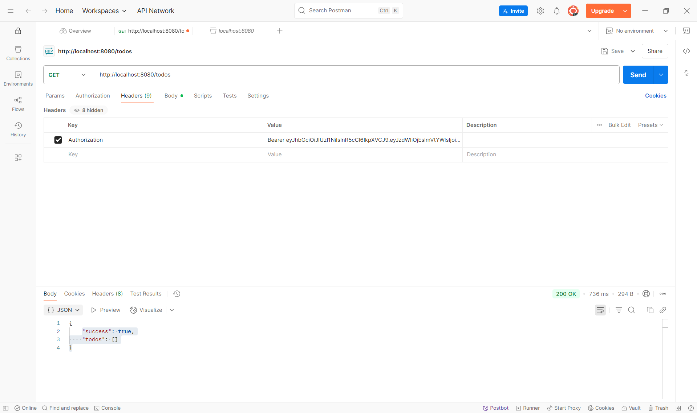

# JWT Token Generation and Usage

To securely test the protected API routes of this project, I created a script called `generatetoken.js`. This script generates a **JSON Web Token (JWT)** needed for authenticating requests to the backend server.

## What `generatetoken.js` Does

- Uses the `jsonwebtoken` library to create a signed JWT using a secret key stored in the `.env` file.
- The token payload includes user information, such as:
  - `sub`: user ID (e.g., `1` for testing)
  - `email`: a sample email address (e.g., `test@example.com`)
- The script outputs the token to the console. This token can then be copied and used as a Bearer token in tools like Postman to authorize API requests.

## How the Token is Used

- When making requests to protected routes (e.g., `/todos`), the token must be included in the HTTP Authorization header as:

```
Authorization: Bearer <your-token-here>
```

- This token allows the backend middleware to verify the user’s identity and grant access to the secured endpoints.

## Security and Environment Variables

- For security reasons, the JWT secret key and database credentials are stored in a `.env` file, which is **not** committed to the public GitHub repository.
- The `.env` file is listed in `.gitignore` to ensure sensitive information such as passwords and tokens remain private.
- In the screenshots provided, you will see the token value included in the Postman Authorization header. However, the full secret keys or passwords are never exposed publicly.

## Sample `generatetoken.js` Code

```js
import jwt from 'jsonwebtoken';
import 'dotenv/config'; // Loads environment variables from .env

const secret = process.env.JWT_SECRET;

const payload = {
  sub: 1, // Example user ID for testing
  email: 'test@example.com',
};

const token = jwt.sign(payload, secret, { expiresIn: '1h' });

console.log('Your test JWT token:\n', token);
```

This setup allowed me to test and verify that the backend authentication middleware is correctly protecting routes, ensuring only requests with a valid token can access the API.

## Authentication Test Result

The following screenshot demonstrates a successful API request using the generated JWT token in Postman. The request to a protected route (e.g., `/todos`) was authorized and returned the expected response:


